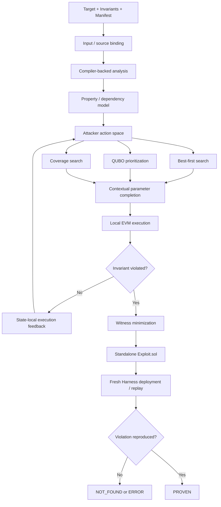

# QProver 아키텍처

## 목표

QProver는 실행 가능한 invariant counterexample을 탐색합니다.
Analysis와 optimization은 유망한 candidate를 찾는 데 사용되며,
실제 violation은 concrete EVM execution으로만 확정합니다.
Track 04의 최종 성공 기준은 생성된 standalone exploit을 fresh
organizer-compatible Harness에서 다시 실행해 같은 violation을 재현하는 것입니다.

아키텍처는 크게 네 가지 관심사를 분리합니다.

1. property와 관련된 code/state 식별
2. 평가할 attack sequence 선택
3. concrete address/value로 sequence 구체화
4. 실행, minimization, fresh replay

## 전체 흐름



## 주요 컴포넌트

| 영역 | 주요 모듈 | 역할 |
|---|---|---|
| Input / artifact | `manifest.py`, `artifacts.py`, `trust404.py` | 입력 검증, source identity binding, compiler artifact 생성 |
| Semantic analysis | `analysis.py`, `graph.py`, `trust404_analysis.py` | ABI, storage, call, value-flow, guard, property fact 추출 |
| Search model | `models.py`, `hypotheses.py`, `trust404_frontier.py`, `trust404_resources.py` | action, transition, relevance, bounded domain 구성 |
| Search strategy | `search/` | best-first, risk, coverage, random, QUBO candidate ordering |
| Execution | `evm.py`, `evaluator.py`, `trust404_runner.py` | Anvil state 관리, candidate 실행, invariant 평가 |
| Proof | `minimizer.py`, `trust404_harness.py`, `certificate.py`, `replay.py` | witness minimization, replayable evidence 생성 |
| Publication | `safeio.py`, `report.py` | artifact와 deterministic report 기록 |

## 입력과 Compiler Evidence

Manifest는 source identity, deployment rule, actor, balance, predicate,
search budget, execution setting을 정의합니다.
TRUST404 adapter는 search 전에 target, invariant contract, manifest,
optional setup script를 검증합니다.

Compiler artifact에서 다음 정보를 사용합니다.

- function visibility, mutability, signature, selector
- storage read/write
- internal/external/low-level call
- receiver identity와 value transfer
- guard와 call/write ordering
- source-qualified contract/function identity
- parameter completion에 사용하는 constant와 bounded constraint

분석은 compiled source closure를 대상으로 수행합니다.
Temporary build workspace를 사용할 수 있지만 final proof에 사용되는 supplied source를
교체하거나 수정하지 않습니다.

## Property / Action Model

Invariant compiler pass는 manifest predicate를 declaration과
`Invariants.checkAll` 내 위치에 binding합니다.
Property dependency를 통해 관련 storage, call, value, reachable contract instance를 찾습니다.

Attacker action은 generic ABI call입니다.
Action 간 edge는 compiler-derived read/write relationship, call relationship,
value dependency, property relevance를 나타냅니다.
Callback은 bounded generic instruction model을 사용하며,
특정 vulnerability용 exploit template를 선택하지 않습니다.

## Search Portfolio

모든 strategy는 동일한 search problem과 공통 budget을 사용합니다.

- **best-first / risk-guided search** — semantic relevance, transition value,
  feasibility, observed outcome으로 prefix를 ranking
- **QUBO-guided search** — action utility, pairwise transition value,
  repetition cost, execution feedback을 포함한 bounded sequence model을 sampling
- **coverage-guided search** — 새로운 trace/state feature를 노출한 sequence를 유지·변형
- **random search** — benchmark에서 seeded comparison baseline 제공

QUBO는 candidate sequence를 만들고 prioritization할 뿐 verdict를 만들지 않습니다.
현재 backend는 seeded classical simulated annealing을 사용하며,
bounded model에는 exact classical solving도 사용할 수 있습니다.

`SearchController`는 candidate, transaction, wall-clock budget을 적용합니다.
Strategy 비교는 동일한 EVM-work budget을 사용할 때만 의미가 있습니다.

## Contextual Parameter Completion

Action skeleton은 typed value expression을 가집니다.
Address candidate는 attacker, current contract, root target, reachable instance,
이전 action에서 관찰한 address 등을 참조할 수 있습니다.

Integer candidate는 runtime getter, prior observation, scaled value,
compiler constant, ABI boundary, bounded Z3-supported constraint를 사용할 수 있습니다.

Candidate value는 실행되기 전까지 hypothesis입니다.
Solver 결과만으로 EVM execution이나 supplied invariant check를 우회할 수 없습니다.

## 실행과 Feedback

Anvil은 controlled deployment state와 snapshot을 제공합니다.
Runtime은 candidate를 실행한 뒤 원본 `Invariants.checkAll(target)`을 호출하고
다음 중 하나를 기록합니다.

```text
PASS / REVERT / INCONCLUSIVE / INFRA_ERROR / VIOLATION
```

Pass, revert, observation, state fingerprint는 shared frontier를 갱신합니다.
Revert feedback은 해당 state/parameter context에만 적용됩니다.
Compiler 또는 infrastructure failure를 action revert로 학습하지 않습니다.

Configured time/attempt budget 안에서 violation을 찾거나 budget을 소진할 때까지 반복합니다.

## Minimization / Proof

Violation을 만든 sequence는 concrete replay를 통해 불필요한 action을 제거합니다.
최소화된 candidate는 generic renderer를 거쳐 `Exploit.sol`로 생성됩니다.

Track 04 proof 경로는 다음과 같습니다.

1. fresh target/invariant deployment 생성
2. standalone exploit을 organizer-compatible Harness에서 build/execute
3. validated order로 supplied predicate 평가
4. violation이 다시 재현될 때만 `PROVEN` 반환

Demo와 benchmark interface는 certificate, generated Foundry replay test,
execution hash, cold replay record도 생성합니다.
이 artifact들 역시 search output이 아니라 concrete execution을 결과 기준으로 사용합니다.

## Artifact Publication

Proof artifact는 fail-closed 규칙으로 기록됩니다.
Output handling은 symlink/special file을 거부하고 directory identity와 tree hash를 검증하며,
가능한 경우 atomic rename을 사용합니다.

`NOT_FOUND`와 `ERROR`는 stale success artifact를 explicit no-op exploit으로 교체합니다.

Local-host boundary는 동일한 user identity를 가진 malicious process까지 방어한다고 주장하지 않습니다.

## Benchmark Isolation

Benchmark runner는 label을 받지 않습니다.
Append-oriented `runs.jsonl` journal을 기록하고 전체 run matrix를 검증한 뒤에만
scorer가 `labels.json`을 읽습니다.

Suite, configuration, source, tool, matrix, journal, artifact hash를 통해
서로 다른 experiment의 결과가 조용히 섞이는 것을 방지합니다.

## 보안 경계

- Bundled workflow는 local Anvil에서 실행되며 public-chain transaction을 broadcast하지 않습니다.
- 지원하지 않는 compiler/deployment/setup/proof semantics는 fail closed합니다.
- Search score, symbolic candidate, solver exhaustion은 proof가 아닙니다.
- Proxy/delegatecall recovery, arbitrary contract creation, complex ABI synthesis,
  unrestricted callback은 complete-support boundary 밖에 있습니다.
