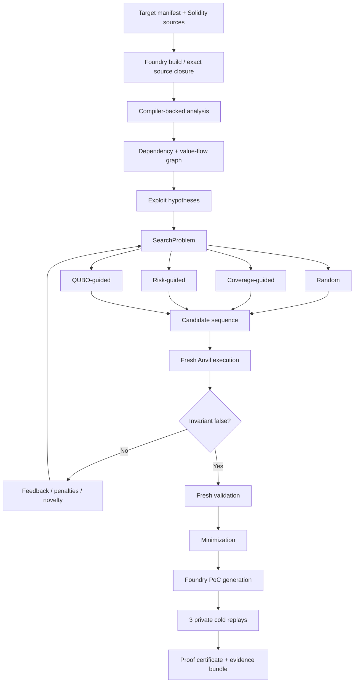
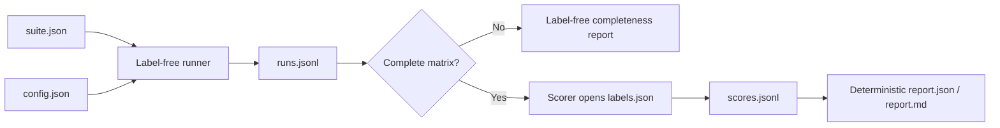

# QProver Architecture

## 1. Goal

QProver is an autonomous exploit prover, not a vulnerability classifier. Its terminal success condition is an **executed, manifest-bound invariant violation** followed by a minimized PoC and deterministic replay evidence.

The system separates four questions that are often conflated:

1. **What code/state is security-relevant?** — analysis and graph construction.
2. **Which attack path should be tried next?** — search/optimization.
3. **Which concrete values satisfy the path?** — finite-domain generation and solver-assisted parameter reasoning.
4. **Did the exploit really work?** — EVM execution and invariant evaluation.

Only the fourth question can create a confirmed exploit.

## 2. End-to-end flow



## 3. Input and compiler evidence

`TargetManifest` is strict and frozen. It binds:

- project/source identity;
- compiler/EVM version;
- actors and initial balances;
- deployments and constructor arguments;
- callable attack actions and bounded argument/value domains;
- observations;
- invariants;
- confirmation policy;
- search limits.

`artifacts.py` builds in isolated Foundry outputs and retains compiler evidence. Analysis uses the compiled artifact/source closure rather than trusting a loose source filename.

## 4. Analysis and graph

`analysis.py` and `graph.py` extract machine-consumable facts rather than producing a cosmetic diagram. Relevant facts include:

- contracts and callable functions;
- storage reads/writes;
- external calls and low-level calls;
- value-transfer behavior;
- control/data relationships;
- ordered call-before-write facts;
- source-qualified function identities.

`hypotheses.py` transforms these facts into label-neutral exploit hypotheses. Hypotheses are leads, not findings.

## 5. Search abstraction

Every strategy implements the same lifecycle:

```text
initialize(SearchProblem, seed)
propose(remaining_transactions) -> Candidate | None
observe(candidate, Evaluation)
stats -> StrategyStats
```

`SearchController` enforces common candidate, transaction and wall-clock budgets. This is important: comparison should measure prioritization quality, not give one strategy more EVM work.

### 5.1 Random

Seeded uniform action/variant sequence sampling. This is the simplest stochastic baseline.

### 5.2 Coverage-guided

Maintains a corpus using new trace features and observation-state fingerprints, then mutates useful sequences.

### 5.3 Risk-guided

Deterministic beam-prefix ranking over static utility, pairwise transition value, hypothesis relevance, novelty and observed reverts.

### 5.4 QUBO-guided

QProver translates sequence prioritization into a binary quadratic model (BQM/QUBO). Objective terms can represent:

- static action utility;
- pairwise transition benefit;
- hypothesis relevance encoded upstream in the problem;
- dynamic revert penalties;
- dynamic successful-transition feedback;
- sequence-length cost;
- repetition/feasibility constraints.

The backend is pluggable. The verified benchmark uses **simulated annealing**. Exact classical solving is also available for bounded models.

QUBO is deliberately not used as a truth oracle. A low-energy sample merely becomes a candidate transaction sequence; it still must execute on the EVM.

## 6. Concrete execution and self-validation

`evm.py` owns a fresh local Anvil process. `evaluator.py` deploys the target, executes candidate steps and evaluates observations/invariants.

The control loop is:

```text
candidate
  -> execute
  -> PASS / REVERT / INCONCLUSIVE / INFRA_ERROR / VIOLATION
  -> strategy observes concrete result
  -> next candidate
```

A candidate that misses the invariant returns to search. `solver_exhausted_unproven` is not interpreted as safety.

## 7. Confirmation semantics

QProver distinguishes:

- `NOT_CONFIRMED`
- `CANDIDATE_VIOLATION`
- `CONFIRMED`

An executed invariant flip is necessary but not by itself enough for final `CONFIRMED`. The proof pipeline:

1. accepts only an in-budget first-violation prefix;
2. truncates any irrelevant suffix;
3. evaluates the prefix again on a fresh baseline;
4. minimizes it;
5. runs a final fresh admissibility check;
6. creates PoC and certificate artifacts;
7. cold-replays the exact proof three times;
8. publishes only after all proof gates succeed.

Economic fixtures can additionally require measured attacker gain/protocol loss. Invariant-only fixtures use explicit `not_applicable` impact evidence rather than fake zeros.

## 8. Minimization and proof certificate

`minimizer.py` removes unnecessary transactions while preserving the executed violation. The certificate records, among other evidence:

- target/source identity;
- initial and final state evidence;
- selected invariant;
- exact transaction sequence;
- execution/trace hashes;
- optional economic impact;
- generated PoC identity;
- replay recipe;
- three replay records.

The generated Foundry test asserts the exact baseline, transactions, final state and invariant transition.

## 9. Safe artifact publication

Proof artifacts are security-sensitive evidence. `safeio.py` uses identity-pinned private directory leases and fail-closed publication rules:

- reject symlinks/special files/hard-linked files;
- retain parent/root device+inode identity;
- hash and snapshot the exact tree;
- revalidate before and after atomic rename;
- quarantine post-rename integrity failures when safe;
- never delete a pathname that has been replaced by a later owner;
- treat parent `fsync` failure as a durability warning only after integrity is already validated.

The trust boundary explicitly does not claim cryptographic protection against a malicious same-UID local host.

## 10. Benchmark evidence boundary

Benchmarking intentionally isolates discovery from labels.



The runner API has no labels parameter. `runs.jsonl` is append-only evidence with matrix/run/artifact hashes. Labels and supplied witnesses are scorer-only.

## 11. Reproducibility identities

The benchmark matrix binds canonical suite/config plus target/build/problem/source/tool identities. A Git `HEAD` is metadata, not the primary identity, because a dirty tree can share a commit ID with different bytes.

Reports include semantic hashes so a result cannot silently mix a different suite, config, matrix, labels or run journal.

## 12. Security boundaries and non-goals

Current release scope:

- fresh local Anvil execution;
- bounded manifest-defined actions;
- no arbitrary wallet/RPC signing interface;
- no public-chain transaction broadcasting;
- no claim that solver exhaustion proves safety;
- no quantum-advantage claim;
- official Track 04 CLI and participant-package format validation, with unsupported setup semantics rejected closed.

The TRUST404 adapter binds the supplied target, invariants and manifest throughout analysis and fresh final proof, translates only supported semantics and fails closed on unsupported deployment/setup rules.


## Track 04 v2.5 property-directed path

The TRUST404 adapter adds a property/state/runtime layer without changing the core proof rule:

```text
Invariants.sol
  -> PropertyFact / PropertySlice
  -> relevant resources/actions
  -> shared SearchState frontier
  -> best-first + short-horizon QUBO + coverage portfolio
  -> contextual ValueExpr completion
  -> persistent SearchAttacker on deterministic Anvil snapshots
  -> original Invariants.checkAll(target)
  -> execution-backed witness minimization
  -> standalone Exploit.sol
  -> organizer Harness fresh proof
```

Runtime contract identities are canonicalized by concrete address. Revert feedback is state-local and parameter-local; infrastructure/compile failures are not learned as action reverts. Generic receive/fallback callback programs contain ordinary call instructions and do not encode vulnerability labels. Only the fresh organizer Harness may produce the final successful Track 04 exit code.
